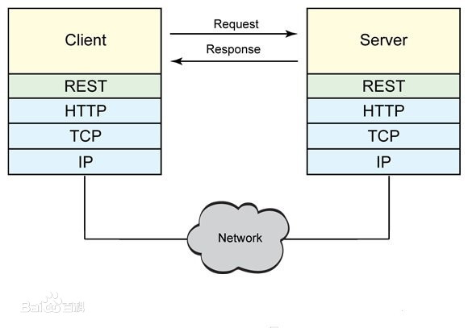

## REST

Representational State Transfer

- 资源（Resources): 信息实体， 每个资源有独一无二的标识符URI， 可以通过URI（统一资源定位符）访问资源
- 表现层（Representation): 资源表现出来的形式， exp: text, html, xml, png等这个不同的文件类型都是资源的表现形式
我们在请求资源的时候通常会通过http请求，```http://xxx.com/xx/xxx.html```， 这边的后缀是可以省略的，真正决定资源表现形式的是http请求头里的
```Accept``` 和 ```Content-Type```字段

## 特点

RESTFUL特点包括：
1、每一个URI代表1种资源；
2、客户端使用GET、POST、PUT、DELETE4个表示操作方式的动词对服务端资源进行操作：GET用来获取资源，POST用来新建资源（也可以用于更新资源），PUT用来更新资源，DELETE用来删除资源；
3、通过操作资源的表现形式来操作资源；
4、资源的表现形式是XML或者HTML；
5、客户端与服务端之间的交互在请求之间是无状态的，从客户端到服务端的每个请求都必须包含理解请求所必需的信息。

## 总结

RESTful 架构简单理解就是对Http传输URI的一种规范
RESTful架构是对MVC架构改进后所形成的一种架构，通过使用事先定义好的接口与不同的服务联系起来。在RESTful架构中，浏览器使用POST，DELETE，PUT和GET四种请求方式分别对指定的URL资源进行增删改查操作。因此，RESTful是通过URI实现对资源的管理及访问，具有扩展性强、结构清晰的特点。

RESTful架构将服务器分成前端服务器和后端服务器两部分，前端服务器为用户提供无模型的视图；后端服务器为前端服务器提供接口。浏览器向前端服务器请求视图，通过视图中包含的AJAX函数发起接口请求获取模型。

项目开发引入RESTful架构，利于团队并行开发。在RESTful架构中，将多数HTTP请求转移到前端服务器上，降低服务器的负荷，使视图获取后端模型失败也能呈现。但RESTful架构却不适用于所有的项目，当项目比较小时无需使用RESTful架构，项目变得更加复杂。



